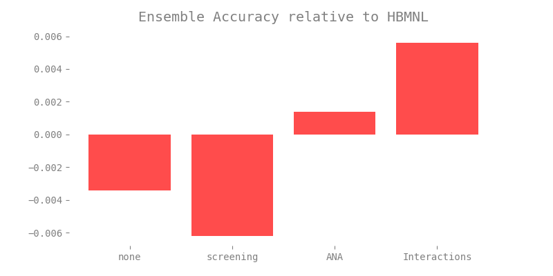

# Introduction

Ensemble-based approaches currently dominate the world of competitive out-of-sample prediction. From Kaggle to the Netflix Prize, the predictive power inherent in using many models overshadows prediction reliant on the performance of a single model. The primary reason ensembles predict so well is that they serve as a hedge against model misspecification. Since we have uncertainty about the correct model for any given context, running many models and producing a consensus is a simple yet powerful way to improve predictions.

In the world of conjoint, most studies are conducted using a single model. When the aim of a conjoint study is solely inference and not prediction, a single-model approach is arguably best. The academic literature for conjoint is filled with models designed to improve inference, especially when respondents behave in ways that deviate from the standard model. For example, models that account for screening behavior, respondent quality, and attribute non-attendance account specifically for deviations. We refer to these and other respondent-level behaviors that deviate from the assumptions of the normative model of consumer choice as "data pathologies."

While each of the models that address a specific data pathology have been shown to improve both model fit and inference in contexts where that particular data pathology is present, none of these approaches has had a meaningful impact on the practice of conjoint.  In our opinion, this is the result of three key factors. First, the derivation and implementation of these models is complex and thus tough for practitioners to understand, implement, and sell to clients. Second, there is a lack of commercial software than can be used to easily implement and simulate from these models. The custom coding is required that can dramatically increase the expense and cycle time of a project. Third, each model is designed to capture a single pathology in the data. While this is useful, it is highly likely that multiple pathologies may be present and problematic in any given study.

In this paper we explore alternative strategies for simultaneously accommodating multiple data pathologies in a single modeling framework. Our approach draws heavily on innovations in machine learning, in particular the work of Breiman (2001) who showed remarkable improvement in prediction resulting from averaging (or taking the consensus prediction) from an ensemble of diverse models. Breiman’s approach relies on the use of randomization to create diversity in the data used to calibrate an ensemble of models, thus helping hedge against model misspecification and overfitting.

We argue there are three reasons to argue for an ensemble-based approach to conjoint analysis. First, the end goal of many conjoint studies is prediction in the form of accurate market simulations and thus a single-model approach is a mismatch with the objective. Second, we still have uncertainty about the correct model for any given conjoint study, in particular it is often impossible to no a prior what data pathology is present and thus which pathology-specific model to employ. Third, there is no single model that accounts for all the respondent behaviors that result in the data pathologies that have been addressed separately in the literature.

The remainder of the paper will be organized as follows. In Section 2, we walk through ensemble approaches to prediction. In Section 3, we specify our ensemble approach to conjoint analysis. In Section 4, we provide results from simulation studies. We provide evidence from empirical applications in Section 5. Finally, in Section 6, we conclude.

# Data Pathologies/Accommodating Data Pathologies

## Attribute Non-Attendance

Respondents may ignore an attribute because it either does not affect their utility or they want to simplify the choice task (Alemu et al. 2012). This pathology is called attribute non-attendance (ANA). Yegoryan et al. (2018) found that the majority of respondents used only three to four attributes out of the six available. Because of ANA, a model that assumes the use of all attributes may be biased. One of the best approaches found to mitigate the effect of ANA is a latent class model (Hess & Hensher 2013, Hole 2013).

## Screening Rules

Research in market-based product design has often used compensatory preference models (that assume an additive part-worth rule), however literature has shown that consumers often use noncompensatory heuristics (Shin & Ferguson 2016). It cannot be assumed that respondents only come to a decision by considering all of the attributes, adding up all the positives and negatives, and choosing the best net sum.  Respondents come with priorities and use heuristics: they might have a minimum requirement that must be met or they may require the inclusion of other features to make up for missing features. Within conjoint, alternatives that pass a respondent's mental 'screen' are evaluated; alternatives that do not pass the screen are not evaluated. Models have been constructed to account for the bias that comes from both noncompensatory and compensatory screening rules (Gilbride & Allenby 2004).

# Ensemble Approaches to Prediction

We may want to merge with the introduction (this is where we'll need a number of references).

Update the end of the section once we've determined which randomization scheme(s) we actually use.

Flesh out the "topological coverage" justification for the ensemble (consider moving entirely to model specification).

Often, scientific models are used for explanation, meaning they are used to test causal theories (Schmueli 2010). While important for social science research, explanatory models may not yield good predictions. Profit-maximizing firms depend on the ability to anticipate consumer response to product offerings. Hence, what the firm often requires is a good predictive model. For conjoint analysis, the hierarchical linear model is a good explanatory model but its predictions do not take full advantage of the complexity in the data. This is particularly pronounced when the data contains multiple data pathologies. Predictive accuracy can be improved without totally sacrificing the ability to understand why respondents made their choices.

One way to achieve greater predictive accuracy is to use a collection of individual or base models aggregated in such a way that the aggregated model performs better than any individual model with respect to some performance criterion. This approach is called *ensembling* and was formally introduced in Breiman (2001). To see why an ensemble approach is the preferable strategy for dealing with multiple data pathologies in conjoint studies, consider the following alternative strategies.

The first strategy is to include the effects of the data pathology in a specific model. Several papers have been published to this effect [*citation needed*]. The advantage of this approach is that the model will be the optimal model. However, this approach has several disadvantages. The most obvious is that in order to account for the pathology, the tailored model must increase in complexity. This complexity is both technical and conceptual. More complex models are less likely to be used by practitioners.

Furthermore, this strategy assumes that the analyst is able to exactly specify the data generating process of the pathology. This is a strong assumption and likely does not hold in the majority of cases. In addition to the increased complexity, tailored models are more computationally intensive than standard models. In this case, the marginal benefit provided by the tailored model would have to exceed the marginal cost associated with the additional computation. Computational complexity usually increases super-linearly whereas improved model performance is sub-linear or linear at best.

Even if some practitioners are able to account for the pathology and can afford the increased computational cost, the tailored model is not robust to pathologies in the data other than those accounted for by the model. If other pathologies are unexpectedly present, the model will perform suboptimally.

The second strategy is to account for data pathologies in a way that is more flexible than the first strategy. This could be reasonably done during the process of constructing the priors of a Bayesian model. This is a similarly principled modeling approach since knowledge of potential data pathologies constitutes prior information that can be represented by the prior distribution. The model can represent any number of data pathologies as well as their interactions by using a mixture prior.

Additionally, we can still use the standard multinomial logit model or any model of discrete choice that can be formulated as a Bayesian model; accounting for pathologies in the prior means we don't have to change the structure of our model. With this, we get accurate inference on all of the parameters jointly and the resulting predictions are more reliable. Of course, the ideal case is unrealistic and presents a variety of problems. Certainly, if only a few pathologies are present, then the mixture model approach is best. However, the computational intensity spikes for nontrivial pathologies.

In some cases, a sufficiently complicated prior may lead to an intractable posterior, at least given the current tools for Bayesian analysis. Furthermore, knowledge of the pathologies is assumed to be known beforehand. Sometimes this is reasonable but for general purpose software solutions, this is unrealistic. In addition, the different pathologies may interfere with each other in the prior. This can create multimodal posteriors (which results in model and computational complexity) or unidentifiable regions in the posterior (which prevents the model from capturing the effects of the pathology).

Finally, adding additional structure for pathologies that in reality are not present is undesirable but largely unavoidable. This leaves us with a method that is complete in scope but computationally unrealistic and does not scale linearly with the addition of more pathologies.

Instead of the above strategies, we advocate an ensemble approach. If the ideal model is a Bayesian mixture model, we can approximate the mixture model with an ensemble of base models fit to different subsets of the input data. The critical assumption here is that the "true" mixture model can be approximated as a convex combination of base models. The goal is to choose a list of base models such that the ideal mixture model is in the span of our list of base models.

The way to create this list is by assigning each base model to "cover" a specific subset of the input data. This list of base models is chosen such that their union forms a topological cover of the input space. Note that it is not necessary to specify the exact base models that form the theoretically true convex combination of base models; it is sufficient to provide a list of models from which the convex combination can be generated. Additionally, it is not necessary that the base models be completely disjoint. However, the coverage of the ensemble of base models will increase if the base model overlap is minimized.

By way of example, suppose each base model is trained on $l-1$ of the features where $l$ is total number of independent variables in the data set. By restricting information, each individual base model will under-perform relative to the standard hierarchical model. However, this also allows the base model to gain additional information by focusing more on the variables that are available. When the base model predictions are aggregated and weighted according to base model performance, the additional information available will cause the ensemble to outperform the standard hierarchical model in terms of out of sample predictive performance.

We could choose the base models a different way. For example, each base model could be specified with a different prior that accounts for a specific pathology or respondent behavior. Then the base models will generate predictions that account for the effects of each pathology respectively. **Other ways of specifying base models include dropping individuals or choice-tasks from the design matrix. In this paper, we show results for the ensemble generated by base models trained on $l-1$ feature variables.**

The ensemble approach does come with some disadvantages. For example, our inferences are certainly biased. However, a relatively small increase in bias results in a much larger increase in predictive accuracy (Schmueli 2010). The ensemble approach is also scalable in the number of pathologies, easier to understand conceptually, and fairly easy to implement. The ensemble will continue to improve as additional base models are included with the existing base models.

# Model Specification

## Pareto k diagnostic warnings

To run an ensemble of choice models, we are using a variational approximation to full posterior inference. This greatly reduces the computational burden of running the ensemble and is justified since our focus is on prediction in market simulation rather than using the full posterior inference. One consistent challenge with variational approximation lies within...

Pareto smoothing is using in computing the LOO-PSIS, but we see the same error when using the variational approximation: "Warning: Pareto k diagnostic value is 1.54. Resampling is disabled. Decreasing tol_rel_obj may help if variational algorithm has terminated prematurely. Otherwise consider using sampling instead."

We can set this convergence tolerance < 0.01 via tol_rel_obj = 0.0001 to try and mitigate warning/improve fit, but it doesn't seem to have much effect. As of right now, we ingore this warnings since the errors may likely be induced by our modification of the parameter space as we induce randomization in proxy of pathological behaviors. Instead of trying to evaluate which observations may be leading to challenges with Pareto-smoothing, if we see this same error propogated in the absence of any randomization, that should indicate it is indeed the randomization leading to the challenges.


Describe stacking as an ensemble approach (point estimates versus distributions).

Finish describing coverage metric as an approximate measure of base model overlap.

Update the references to models and in-sample and out-of-sample predictions once we've determined what we're using.

This paper applies the stacking approach to constructing an ensemble predictor. Stacking is a method for combining the predictions of $K$ different models by weighting the models based on their performance in cross-validation (Clarke 2018). In a stacking approach, a selection of base models is chosen which are trained to input data $X$ on outcomes $Y$. **Each of these models are trained on the input data and generate predictions for a holdout set. The base models are tested for accuracy by comparing in-sample predictions to the actual in-sample results. The base models are then weighted according to their accuracy.**

Let $X$ denote the experimental design of the conjoint study and let $Y$ denote the outcome. If $f_k$ is the $k$th base model with corresponding parameters $\theta_k \in \Theta$, then the ensemble model $F$ is

$$F(X,Y|\Theta) = \sum_{k=1}^K \hat{w_k} f_k(X, Y|\theta_k).$$

The weights $\hat{w_k}$ can be optimized for predictive performance according to the logarithmic score criterion for the stacking of posterior distributions given in Yao et al. (2018). Each of the $f_k$ are **logit models** previously fit to a subset of the input data $X,Y$. We chose to implement our model in Stan to take advantage of recent improvements to the sampling strategy associated with Hamiltonian Monte Carlo. Details on the model code can be found in the appendix.

## Coverage Metric

The predictions generated by the ensemble are distributed among the possible alternatives for each choice task. Each of the models predicts which alternative is the one chosen by the respondent in the choice task. The coverage metric looks at the model predictions and for each observation (respondent-choice-task) and selects the maximum number of models whose predictions agree. This gives a rough sense of the heterogeneity in the model predictions. We want the models to be sufficiently similar that many agree but sufficiently different so that when they disagree, there is still a consensus. This is a rough measure of the topological cover argument we make above.

# Simulation Studies

Split data into training set, test set, and holdout set. The training data will be used to train the base models. The holdout set is used to determine ensemble performance (as opposed to the base model performance). Divide the training set in half. Use the first half as a simulated training set for the base models. Then generate predictions on the input data of the second half of the training set. Repeat this but switch the roles of the two halves of the training set.

Next, train the base models on the entire training set and make predictions on the holdout set. You will now have base model predictions for three data sets: the first half of the training set, the second half of the training set, and the holdout set.

Concatenate the predictions from the two halves of the training set. Regress (logistic) the actual responses on these base model predictions. This gives coefficients that weight the base models according to their ability to predict within the training set. Weight the base model prediction distributions of the holdout set by the generated coefficients. This generates new weighted prediction distributions. Find the mode of this new predictive distribution. This mode is the ensemble's prediction.

```{r ensemble-relative, echo = FALSE, out.width = "75%", fig.align = "center", fig.cap = "The x-axis represents the induced pathology."}

```

# Empirical Application

# Conclusion

# Possible References?

Alemu, M. H., Morkbak, M. R., Olsen, S. B., & Jensen, C. L. (2013). Attending to the reasons for attribute non-attendance in choice experiments. Environmental and Resource Economics, 54 (3), 333–359.

Yegoryan, N., Guhl, D., & Klapper, D. (2018). Inferring Attribute Non-Attendance Using Eye Tracking in Choice-Based Conjoint Analysis. 

Hess, S., & Hensher, D. A. (2013). Making use of respondent reported processing information
to understand attribute importance: A latent variable scaling approach. Transportation, 40 (2), 397–412.

Hole, A. R. (2011). A discrete choice model with endogenous attribute attendance. Economic
Letters, 110 (3), 203–205.

Gilbride, T., Allenby, G. (2004). A Choice Model with Conjunctive, Disjunctive, and Compensatory Screening Rules. Marketing Science, Volume 23 No. 3.

Shin, J., Ferguson, S. (2016). Exploring Product Solution Differences Due to Choice Model Selection in the Presence of Noncompensatory Decisions With Conjunctive Screening Rules. Journal of Mechanical Design.

# Appendix

This is a summary of our current workflow, including simulating data.

## Data Preparation

`simulate_data()`

- Simulate data with discrete attributes with the same number of levels for each attribute.
- When ANA is flagged, simulate ANA where each respondent pays attention to at least one attribute and has non-attendance for at least one attribute.
- When screening is flagged, simulate screening where each respondent screens based on one attribute level.
- When respondent quality is flagged, force a random choice for up to 25 respondents.
- Generate betas as a random normal deviation from a random uniform average from -1 to 2.
- When generating betas, multiply by ANA indicator and add screening (defaults to 1 and 0, respectively).
- When generating an outcome, set the choice probabilities to equal if the respondent is low quality.

`clever_randomization()`

- Determine the number of observations and the total number of attribute levels, assuming only discrete attributes but not assuming that we have the same number of levels for each attribute.
- Split the data into training and testing data.
- Produce a matrix of randomization patterns for each possible pathology where each row is a new randomization specific to a possible ensemble member.
- Randomize ANA such that each respondent pays attention to at least one attribute and has non-attendance for at least one attribute.
- Randomize screening such that each respondent screens based on at least one attribute level.
- Randomize respondent quality such that we continue with the same number of bootstrapped respondents.

## Conjoint Ensembles

- Load data and draw a sample of ensembles of size `nmember`.
- If a full posterior HMNL has been run, load the model fit, otherwise run a full posterior HMNL.
- Use the HMNL posterior to construct the hyperparameter values for the HMNL ensemble.
- If respondent quality is flagged, the training data is reconstructed using the bootstrapped sample.

`hmnl_ensemble()`

- Both the number of ensembles `K` and the current ensemble `k` are passed to `hmnl_ensemble()` each run.
- If ANA is flagged, the betas flagged for that member are set to 0 in the transformed parameters block.
- If screening is flagged, the betas flagged for that member are set to -100 in the transformed parameters block.


## Meta-Learner

## Competing Models

## Model Comparison

